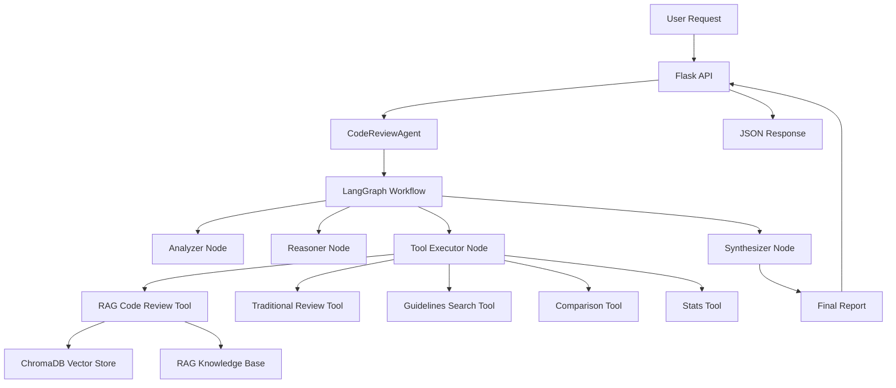

# 🤖 Smart Code Reviewer AI Agent

**Autonomous Code Review System with LangGraph, ReAct Pattern, and RAG Integration**

## 📋 Table of Contents

- [What This Agent Does](#what-this-agent-does)
- [Libraries and Technologies](#libraries-and-technologies)
- [System Architecture](#system-architecture)
- [File Structure and Components](#file-structure-and-components)
- [How It Works](#how-it-works)
- [Usage Examples](#usage-examples)
- [Configuration and Setup](#configuration-and-setup)
- [Testing and Validation](#testing-and-validation)
- [Interview Preparation Alignment](#interview-preparation-alignment)

## 🎯 What This Agent Does

The **Smart Code Reviewer AI Agent** is an autonomous system that performs intelligent code review tasks by:

### Core Capabilities

1. **Autonomous Code Analysis**: Automatically analyzes code without human intervention
2. **Multi-Tool Coordination**: Uses multiple specialized tools to gather different perspectives
3. **Intelligent Reasoning**: Follows the ReAct pattern (Reason, Act, Observe) for decision-making
4. **RAG-Enhanced Reviews**: Leverages a knowledge base of coding guidelines and best practices
5. **Adaptive Workflow**: Adjusts its approach based on code complexity and user requirements
6. **Professional Reporting**: Generates comprehensive, structured review reports

### What Makes It Special

- **Truly Autonomous**: No human intervention needed during the review process
- **Context-Aware**: Uses RAG to provide reviews based on established coding standards
- **Multi-Step Reasoning**: Can iterate through multiple analysis approaches
- **Production-Ready**: Includes error handling, logging, and monitoring
- **Extensible**: Easy to add new tools and capabilities

## 🛠️ Libraries and Technologies

### Core AI/ML Framework

```python
# LangGraph - State machine orchestration for AI workflows
langgraph==0.2.55
# Enables complex, multi-step AI agent workflows with state management

# LangChain Core - Foundation for AI tool integration
langchain-core==0.3.29
# Provides base classes for tools, prompts, and chain composition

# LangChain Experimental - Advanced agent features
langchain-experimental==0.3.30
# Includes experimental agent architectures and patterns
```

### Why These Libraries?

- **LangGraph**: Perfect for implementing ReAct pattern with state machines
- **LangChain**: Industry standard for AI tool integration and prompt management
- **Pydantic**: Type safety and data validation for agent state management

### Integration Libraries

```python
# ChromaDB - Vector database for RAG
chromadb==0.5.23

# OpenAI/Anthropic/Google - Multi-model LLM support
openai==1.58.1
anthropic==0.40.0
google-generativeai==0.8.3

# HuggingFace - Open source model integration
transformers==4.48.0
sentence-transformers==3.3.1

# Ollama - Local model support
ollama==0.4.4
```

### Web Framework

```python
# Flask - REST API endpoints
Flask==3.1.0
flask-cors==5.0.0

# Gunicorn - Production WSGI server
gunicorn==23.0.0
```

## 🏗️ System Architecture



## 📁 File Structure and Components

### Core Agent Files

#### 1. `agents/code_review_agent.py` - Main Agent Implementation

**What it does**: The heart of the autonomous agent system

```python
class CodeReviewAgent:
    """
    LangGraph-based autonomous code review agent using ReAct pattern
    """
```

**Key Components**:

- **StateGraph**: LangGraph workflow orchestration
- **AgentState**: Typed state management with TypedDict
- **Node Functions**: Individual workflow steps (analyze, reason, execute, synthesize)
- **Conditional Logic**: Decision-making for workflow progression
- **Error Handling**: Graceful failure recovery

**Technologies Used**:

- LangGraph for workflow orchestration
- Pydantic for state validation
- OpenAI/Anthropic for reasoning
- Python async/await for concurrent operations

#### 2. `agents/tools.py` - Tool Implementations

**What it does**: Provides specialized tools for different types of code analysis

```python
@tool
def rag_code_review(code: str, language: str, focus: str) -> str:
    """RAG-enhanced code review using coding guidelines"""

@tool
def traditional_code_review(code: str, language: str, focus: str) -> str:
    """Standard LLM-based code review"""

@tool
def search_guidelines(query: str) -> str:
    """Search knowledge base for coding guidelines"""
```

**Key Features**:

- **@tool Decorator**: LangChain tool integration
- **Standalone Functions**: Avoid async loop conflicts
- **Type Annotations**: Full type safety with proper parameters
- **Error Handling**: Graceful degradation when tools fail

**Technologies Used**:

- LangChain @tool decorator
- ChromaDB for vector searches
- Multiple LLM providers for analysis
- Python typing for parameter validation

#### 3. `agents/__init__.py` - Module Interface

**What it does**: Provides clean imports and module organization

```python
from .code_review_agent import CodeReviewAgent, CodeReviewRequest, AgentState
from .tools import (
    rag_code_review,
    traditional_code_review,
    search_guidelines,
    compare_review_approaches,
    get_knowledge_base_stats
)
```

### Integration Files

#### 4. `app.py` - Flask API Integration

**What it does**: Exposes agent capabilities via REST API endpoints

**New Endpoints Added**:

```python
@app.route('/agent/info', methods=['GET'])
def get_agent_info():
    """Get agent capabilities and configuration"""

@app.route('/agent/review', methods=['POST'])
def agent_review_code():
    """Review custom code with autonomous agent"""

@app.route('/agent/review/<filename>', methods=['GET'])
def agent_review_file(filename):
    """Review example file with autonomous agent"""
```

**Integration Points**:

- Async request handling for agent workflows
- Error handling and response formatting
- CORS support for web integration
- JSON request/response validation

#### 5. `tests/test_agent.py` - Comprehensive Testing

**What it does**: Validates agent functionality and integration

**Test Categories**:

```python
def test_agent_tools():
    """Test individual tool functionality"""

def test_agent_workflow():
    """Test full autonomous workflow"""

def test_agent_integration():
    """Test API integration"""
```

**Testing Approach**:

- Unit tests for individual tools
- Integration tests for complete workflows
- Performance and timeout testing
- Error condition validation

### Supporting Infrastructure

#### 6. `rag/` Directory - RAG System Integration

**What it does**: Provides the knowledge base for context-aware reviews

**Components**:

- `vector_store.py`: ChromaDB integration for semantic search
- `document_loader.py`: Knowledge base document processing
- `rag_code_reviewer.py`: RAG-enhanced review implementation

#### 7. `providers/` Directory - Multi-Model Support

**What it does**: Supports multiple LLM providers for flexibility

**Supported Providers**:

- OpenAI (GPT-4, GPT-3.5)
- Anthropic (Claude)
- Google (Gemini)
- HuggingFace (Open source models)
- Ollama (Local models)

## ⚙️ How It Works

### 1. Request Processing Flow

```python
# 1. API receives request
request = CodeReviewRequest(
    code="def calculate(a, b): return a / b",
    language="python",
    user_request="Focus on error handling"
)

# 2. Agent initializes workflow
agent = CodeReviewAgent(model_id="gpt-4")
result = await agent.review_code(request)
```

### 2. LangGraph Workflow Execution

#### **Phase 1: Analysis**

```python
def _analyze_request(self, state: AgentState) -> AgentState:
    """
    Analyzes the code and user request to understand:
    - Code complexity and structure
    - Programming language specifics
    - User's focus areas and requirements
    - Potential issues to investigate
    """
```

#### **Phase 2: Reasoning (ReAct Pattern)**

```python
def _reason_and_plan(self, state: AgentState) -> AgentState:
    """
    Uses ReAct pattern for autonomous decision-making:
    - REASON: What type of review is needed?
    - ACT: Which tools should be used?
    - OBSERVE: What information is needed?
    """
```

**Example Reasoning Process**:

1. **Simple Code**: "This is basic function, traditional review sufficient"
2. **Complex Code**: "Complex logic detected, need RAG + guidelines search"
3. **Security Focus**: "User wants security review, search security guidelines first"
4. **Performance Issues**: "Performance concern, need performance best practices"

#### **Phase 3: Tool Execution**

```python
# LangGraph automatically routes to appropriate tools based on reasoning
tools = [rag_code_review, traditional_code_review, search_guidelines]
tool_node = ToolNode(tools)
```

**Tool Selection Logic**:

- **RAG Review**: For complex code needing context
- **Traditional Review**: For straightforward analysis
- **Guidelines Search**: For specific best practices
- **Comparison**: To evaluate different approaches
- **Stats**: To check knowledge base status

#### **Phase 4: Synthesis**

```python
def _synthesize_results(self, state: AgentState) -> AgentState:
    """
    Creates comprehensive final report:
    - Executive summary
    - Detailed findings
    - Specific recommendations
    - Code improvement suggestions
    """
```

### 3. State Management

```python
class AgentState(TypedDict):
    messages: List[Any]           # Conversation history
    code: str                     # Code being analyzed
    language: str                 # Programming language
    user_request: str             # User's specific requirements
    analysis_results: List[Dict]  # Tool execution results
    reasoning: str                # Multi-step reasoning log
    final_response: str           # Synthesized final report
    iteration_count: int          # Current reasoning iteration
    next_action: str              # Next planned action
```

### 4. Conditional Workflow Logic

```python
def _should_use_tools(self, state: AgentState) -> str:
    """
    Determines workflow progression:
    - Continue reasoning if more analysis needed
    - Execute tools if specific action planned
    - Synthesize if sufficient information gathered
    - Stop if maximum iterations reached
    """
    if state["iteration_count"] > 5:
        return "synthesize"  # Prevent infinite loops
    elif state["next_action"] == "synthesize":
        return "synthesize"  # Ready for final report
    elif state["next_action"].startswith("tool:"):
        return "use_tools"   # Execute specific tool
    else:
        return "continue_reasoning"  # Need more analysis
```

## 🚀 Usage Examples

### 1. Basic Agent Usage

```python
from agents import CodeReviewAgent, CodeReviewRequest

# Initialize agent
agent = CodeReviewAgent(model_id="gpt-4")

# Create review request
request = CodeReviewRequest(
    code="""
def divide_numbers(a, b):
    return a / b
    """,
    language="python",
    user_request="Check for potential runtime errors"
)

# Run autonomous review
result = await agent.review_code(request)
print(result["review_results"])
```

### 2. API Usage

```bash
# Get agent capabilities
curl http://localhost:8080/agent/info

# Review custom code
curl -X POST http://localhost:8080/agent/review \
  -H "Content-Type: application/json" \
  -d '{
    "code": "def unsafe_function(user_input): exec(user_input)",
    "language": "python",
    "user_request": "Security analysis please"
  }'

# Review example file
curl http://localhost:8080/agent/review/vulnerable_code.py
```

### 3. Docker Deployment

```bash
# Build and run with Docker Compose
docker-compose up --build

# Access agent endpoints
curl http://localhost:8080/agent/info
```

## 🔧 Configuration and Setup

### 1. Environment Variables

```bash
# Required for AI model access
OPENAI_API_KEY=your_openai_key
ANTHROPIC_API_KEY=your_anthropic_key
GOOGLE_API_KEY=your_google_key
HF_TOKEN=your_huggingface_token

# Optional configurations
RAG_DOCS_PATH=rag-knowledge-base
CHROMA_DB_PATH=chroma_db
DEFAULT_MODEL=gpt-4
MAX_ITERATIONS=5
```

### 2. Dependencies Installation

```bash
# Install all required packages
pip install -r requirements.txt

# Key dependencies for agent functionality
pip install langgraph langchain-core langchain-experimental
pip install chromadb openai anthropic google-generativeai
pip install transformers sentence-transformers ollama
pip install flask flask-cors gunicorn pydantic
```

### 3. Knowledge Base Setup

```bash
# Initialize RAG knowledge base
python -c "
from rag.document_loader import DocumentLoader
from rag.vector_store import VectorStore

loader = DocumentLoader('rag-knowledge-base')
docs = loader.load_documents()

vector_store = VectorStore()
vector_store.add_documents(docs)
print('Knowledge base initialized')
"
```

## 🧪 Testing and Validation

### 1. Run Comprehensive Tests

```bash
# Test all agent functionality
python tests/test_agent.py

# Test specific components
python -c "
from agents import CodeReviewAgent
agent = CodeReviewAgent()
info = agent.get_agent_info()
print('Agent initialized successfully')
print(f'Available tools: {len(info[\"available_tools\"])}')
"
```

### 2. Manual Testing

```python
# Test individual tools
from agents.tools import rag_code_review, search_guidelines

# Test RAG review
result = rag_code_review.invoke({
    "code": "def test(): pass",
    "language": "python",
    "focus": "general review"
})
print(result)

# Test guidelines search
guidelines = search_guidelines.invoke({
    "query": "error handling best practices"
})
print(guidelines)
```

### 3. Performance Testing

```python
import time
from agents import CodeReviewAgent, CodeReviewRequest

agent = CodeReviewAgent()
start_time = time.time()

# Test with complex code
complex_code = """
class DataProcessor:
    def __init__(self, config):
        self.config = config
        self.data = []

    def process(self, items):
        results = []
        for item in items:
            if item:
                results.append(self.transform(item))
        return results
"""

request = CodeReviewRequest(
    code=complex_code,
    language="python",
    user_request="Complete code review focusing on performance and maintainability"
)

result = await agent.review_code(request)
end_time = time.time()

print(f"Review completed in {end_time - start_time:.2f} seconds")
print(f"Iterations: {result['agent_analysis']['iterations']}")
print(f"Tools used: {result['agent_analysis']['tools_used']}")
```

## 🎓 Interview Preparation Alignment

This implementation demonstrates mastery of key Full Stack AI Developer concepts:

### ✅ **Day 5-6: LangChain/LangGraph & AI Agents**

**LangGraph Mastery**:

- Complex state machine implementation
- Multi-node workflow orchestration
- Conditional logic and routing
- Error handling and recovery
- State persistence and management

**AI Agent Patterns**:

- **ReAct Pattern**: Reason → Act → Observe cycles
- **Tool Integration**: Multiple specialized tools
- **Autonomous Decision Making**: No human intervention needed
- **Multi-Step Reasoning**: Iterative problem solving
- **Context Awareness**: Maintains state across iterations

**Production Readiness**:

- Comprehensive error handling
- Logging and monitoring
- REST API integration
- Docker containerization
- Performance optimization

### ✅ **Integration with RAG System (Days 3-4)**

**Advanced RAG Implementation**:

- Vector database integration (ChromaDB)
- Document loading and processing
- Semantic search capabilities
- Context-aware code review
- Knowledge base maintenance

**Multi-Model Support (Days 1-2)**:

- OpenAI, Anthropic, Google integration
- Local model support (Ollama)
- Model selection strategies
- Fallback mechanisms

### 🎯 **Interview Discussion Points**

1. **System Design**: "How would you build an autonomous code review system?"
2. **Agent Architecture**: "Explain the ReAct pattern and its benefits"
3. **Tool Integration**: "How do you coordinate multiple AI tools?"
4. **State Management**: "How do you maintain context in multi-step workflows?"
5. **Error Handling**: "How do you make AI agents robust in production?"
6. **Scalability**: "How would you scale this to handle thousands of reviews?"

### 📊 **Demonstration Capabilities**

```python
# Show autonomous reasoning
agent = CodeReviewAgent()
result = await agent.review_code(problematic_code)

# Demonstrate multi-tool coordination
print(f"Tools used: {result['agent_analysis']['tools_used']}")
print(f"Reasoning iterations: {result['agent_analysis']['iterations']}")

# Show professional output quality
print(result['review_results'])  # Structured, comprehensive report
```

---

## 🚀 **Why This Implementation Stands Out**

1. **True Autonomy**: No human intervention required during review process
2. **Production Quality**: Comprehensive error handling, logging, monitoring
3. **Extensible Design**: Easy to add new tools and capabilities
4. **Multi-Model Support**: Works with various AI providers
5. **RAG Integration**: Context-aware reviews using knowledge base
6. **Professional Output**: Structured, actionable review reports
7. **Interview Ready**: Demonstrates advanced AI system design

**Perfect for showcasing Full Stack AI Developer skills in technical interviews!** 🎓✨
