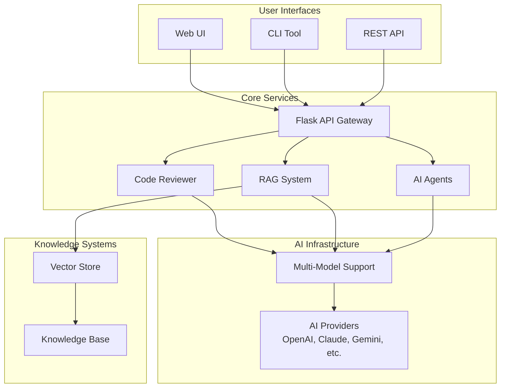

# 📚 Enhanced Smart Code Reviewer Documentation

**Comprehensive documentation for the Enhanced Smart Code Reviewer system**

## 📋 Documentation Index

### 🏗️ Architecture & Design

- **[System Design Document](SYSTEM_DESIGN.md)** - Complete system architecture, components, and design patterns
- **[Architecture Overview](#system-architecture-overview)** - High-level visual architecture

### 📦 Installation & Setup

- **[Installation Guide](INSTALL.md)** - Complete setup instructions with multiple deployment options
  - Docker Installation (Recommended)
  - Local Python Installation
  - Flask API Service Setup
  - API Keys Configuration

### 🚀 Quick Navigation

| Topic                   | Document                                                         | Description                                 |
| ----------------------- | ---------------------------------------------------------------- | ------------------------------------------- |
| **Getting Started**     | [INSTALL.md](INSTALL.md#quick-start-options)                     | Quick setup options and prerequisites       |
| **System Architecture** | [SYSTEM_DESIGN.md](SYSTEM_DESIGN.md#system-overview)             | High-level system overview and capabilities |
| **API Reference**       | [SYSTEM_DESIGN.md](SYSTEM_DESIGN.md#api-design)                  | REST API endpoints and usage                |
| **Docker Deployment**   | [INSTALL.md](INSTALL.md#docker-installation-recommended)         | Containerized deployment guide              |
| **AI Models**           | [SYSTEM_DESIGN.md](SYSTEM_DESIGN.md#ai-integration-architecture) | Multi-provider AI model support             |
| **RAG System**          | [SYSTEM_DESIGN.md](SYSTEM_DESIGN.md#core-components)             | Retrieval-augmented generation details      |
| **AI Agents**           | [SYSTEM_DESIGN.md](SYSTEM_DESIGN.md#core-components)             | Autonomous agent workflows                  |
| **Troubleshooting**     | [INSTALL.md](INSTALL.md#troubleshooting)                         | Common issues and solutions                 |

## 🎯 System Architecture Overview

The Enhanced Smart Code Reviewer is built with a modular, microservices-inspired architecture:



## 🔧 Core Components

| Component                  | Purpose                    | Key Features                                              |
| -------------------------- | -------------------------- | --------------------------------------------------------- |
| **Enhanced Code Reviewer** | Traditional AI code review | Multi-model support, various prompting techniques         |
| **RAG Code Reviewer**      | Context-aware reviews      | Vector search, coding guidelines integration              |
| **AI Agent System**        | Autonomous code analysis   | Tool usage, multi-step reasoning, self-directed workflows |
| **Model Registry**         | AI provider management     | Dynamic model discovery, configuration management         |
| **Vector Store**           | Knowledge retrieval        | ChromaDB integration, similarity search                   |
| **Flask API**              | Web service interface      | RESTful endpoints, async processing                       |

## 📊 Supported Technologies

### AI Models & Providers

- **OpenAI**: GPT-4, GPT-4 Turbo, GPT-3.5 Turbo
- **Anthropic**: Claude 3.5 Sonnet, Claude 4 Sonnet, Claude 3 Opus
- **Google**: Gemini Pro
- **HuggingFace**: Llama 2, custom models
- **Ollama**: Local model deployment (Mistral, etc.)

### Programming Languages

- **Primary**: Python (full feature support)
- **Additional**: JavaScript, TypeScript, Java, C++, Go, Rust
- **Extensible**: Plugin architecture for new languages

### Deployment Options

- **Docker**: Containerized deployment with orchestration
- **Local**: Direct Python installation and execution
- **Cloud**: Scalable cloud deployment ready
- **Hybrid**: Mix of local and cloud AI models

## 🚀 Quick Start

1. **Clone Repository**:

   ```bash
   git clone https://github.com/Danor93/Smart-Code-Reviewer.git
   cd smart-code-reviewer
   ```

2. **Docker Deployment** (Recommended):

   ```bash
   cp .env.example .env
   # Edit .env with your API keys
   ./docker-run.sh build
   ./docker-run.sh run
   ```

3. **Access API**: http://localhost:8080

4. **Test Installation**:
   ```bash
   curl http://localhost:8080/
   curl http://localhost:8080/models
   ```

## 🔗 External Resources

- **Main Repository**: [GitHub - Smart Code Reviewer](https://github.com/Danor93/Smart-Code-Reviewer)
- **AI Provider Documentation**:
  - [OpenAI API Docs](https://platform.openai.com/docs)
  - [Anthropic Claude API](https://docs.anthropic.com/)
  - [Google AI Studio](https://ai.google.dev/)
  - [HuggingFace Documentation](https://huggingface.co/docs)
  - [Ollama Documentation](https://ollama.ai/)

## 🤝 Contributing

For contribution guidelines, development setup, and testing procedures, see the main repository documentation.

## 📞 Support

- **Issues**: GitHub Issues page
- **Documentation**: This docs folder
- **Community**: GitHub Discussions

---

**Last Updated**: December 2024  
**Version**: 1.0.0
