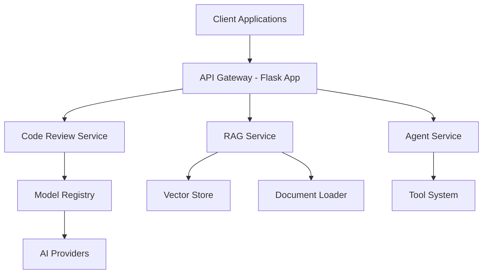
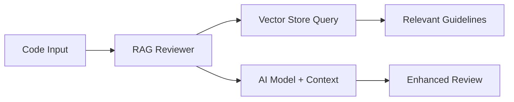
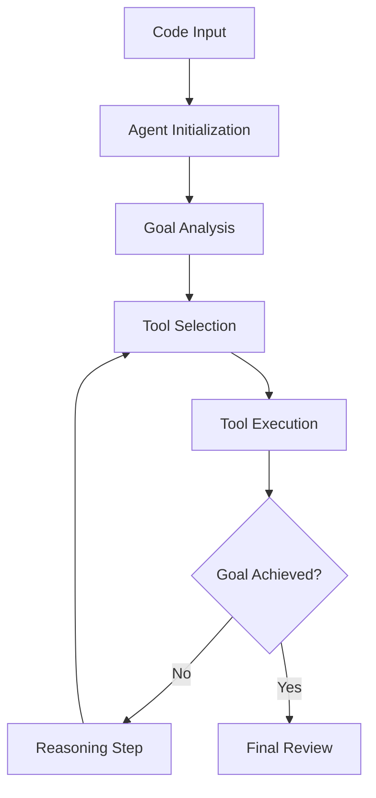
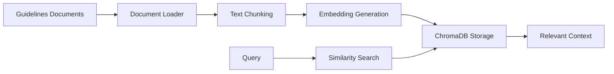
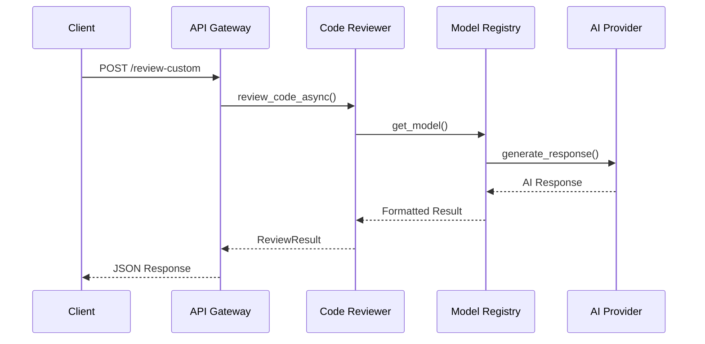
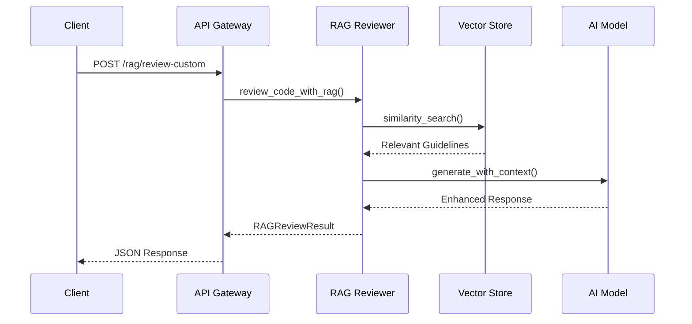
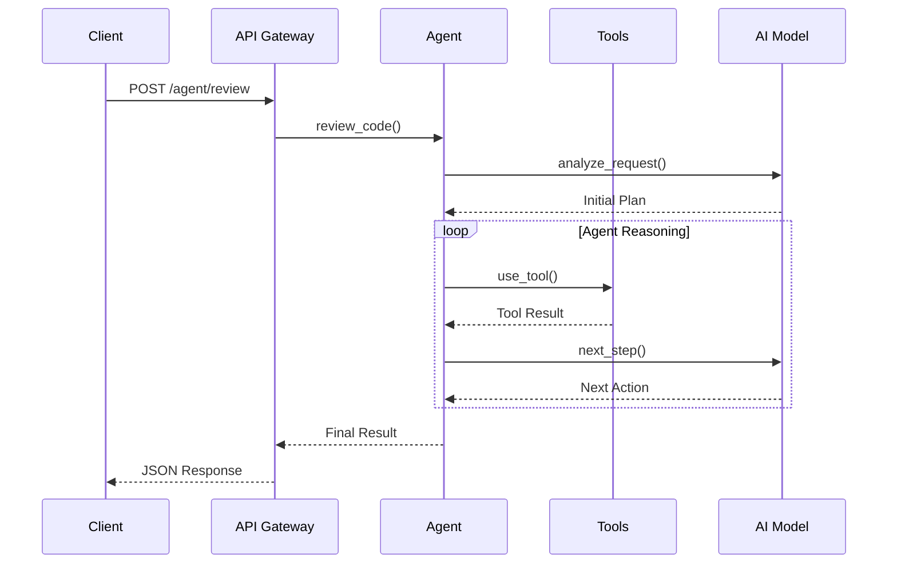
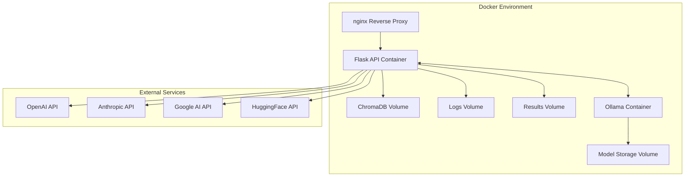
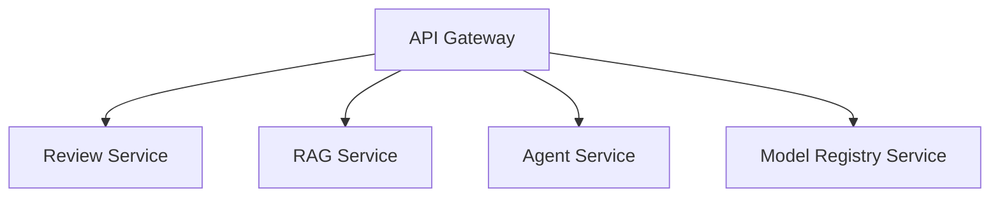

# 🏗️ System Design Document

**Enhanced Smart Code Reviewer - Architecture and Design**

This document describes the system architecture, components, and design decisions for the Enhanced Smart Code Reviewer platform.

## 📋 Table of Contents

- [System Overview](#system-overview)
- [Architecture Patterns](#architecture-patterns)
- [Core Components](#core-components)
- [Data Flow](#data-flow)
- [API Design](#api-design)
- [AI Integration Architecture](#ai-integration-architecture)
- [Storage and Persistence](#storage-and-persistence)
- [Deployment Architecture](#deployment-architecture)
- [Security Design](#security-design)
- [Performance Considerations](#performance-considerations)
- [Extensibility and Scalability](#extensibility-and-scalability)

## 🎯 System Overview

The Enhanced Smart Code Reviewer is a multi-layered AI-powered platform designed to provide comprehensive code analysis and reviews. The system supports multiple AI models, prompting techniques, and autonomous agent workflows.

### Core Capabilities

- **Traditional AI Code Review**: Zero-shot, few-shot, and chain-of-thought prompting
- **RAG-Enhanced Review**: Retrieval-augmented generation using coding guidelines
- **Autonomous AI Agents**: Self-directed code analysis with tool usage
- **Multi-Model Support**: Integration with OpenAI, Anthropic, Google, HuggingFace, and Ollama
- **RESTful API**: Complete web service interface
- **Containerized Deployment**: Docker-based deployment with orchestration

## 🏛️ Architecture Patterns

The system follows several key architectural patterns:

### 1. Microservices Architecture



### 2. Plugin Architecture

- **Model Providers**: Pluggable AI model integrations
- **Review Techniques**: Extensible prompting strategies
- **Agent Tools**: Modular tool system for autonomous agents

### 3. Event-Driven Architecture

- **Asynchronous Processing**: Non-blocking AI model calls
- **Result Streaming**: Real-time review progress updates
- **Agent Workflows**: State-driven autonomous processing

## 🔧 Core Components

### 1. **Enhanced Code Reviewer** (`reviewers/code_reviewer.py`)

**Purpose**: Core code review engine with multiple AI model support

**Key Features**:

- Multi-model integration (OpenAI, Anthropic, Google, HuggingFace, Ollama)
- Multiple prompting techniques (zero-shot, few-shot, chain-of-thought)
- Asynchronous processing for performance
- Comprehensive result formatting

**Interfaces**:

```python
class EnhancedCodeReviewer:
    async def review_code_async(code, language, technique, model_id) -> ReviewResult
    async def compare_models_async(code, language, technique) -> Dict[str, ReviewResult]
    def get_available_models() -> List[str]
```

### 2. **RAG Code Reviewer** (`reviewers/rag_code_reviewer.py`)

**Purpose**: Retrieval-augmented generation for enhanced code reviews

**Key Features**:

- Vector store integration (ChromaDB)
- Coding guidelines knowledge base
- Context-aware review enhancement
- Traditional vs RAG comparison

**Architecture**:



**Interfaces**:

```python
class RAGCodeReviewer:
    async def review_code_with_rag(code, language) -> RAGReviewResult
    async def compare_rag_vs_traditional(code, language) -> ComparisonResult
    def search_guidelines(query, k=5) -> List[Document]
```

### 3. **AI Agent System** (`agents/`)

**Purpose**: Autonomous code review agents with reasoning and tool usage

**Components**:

- **Code Review Agent** (`code_review_agent.py`): Main agent orchestrator
- **Tool System** (`tools.py`): Available tools for agent workflows

**Agent Workflow**:



**Available Tools**:

- Traditional code review
- RAG-enhanced review
- Security analysis
- Performance analysis
- Best practices check

### 4. **Model Registry** (`providers/model_registry.py`)

**Purpose**: Centralized management of AI model configurations and availability

**Features**:

- Dynamic model discovery based on API keys
- Model configuration management
- Provider abstraction
- Health checking

**Configuration Structure**:

```yaml
models:
  gpt-4:
    provider: "openai"
    model_name: "gpt-4"
    temperature: 0.1
    max_tokens: 1000

providers:
  openai:
    env_var: "OPENAI_API_KEY"
    langchain_class: "ChatOpenAI"
```

### 5. **Vector Store System** (`rag/`)

**Purpose**: Knowledge retrieval and storage for RAG functionality

**Components**:

- **Document Loader** (`document_loader.py`): Loads and processes coding guidelines
- **Vector Store** (`vector_store.py`): ChromaDB integration for similarity search

**Data Flow**:



## 🌊 Data Flow

### 1. Traditional Code Review Flow



### 2. RAG-Enhanced Review Flow



### 3. Autonomous Agent Flow



## 🔌 API Design

### RESTful Endpoints Architecture

The API follows REST principles with clear resource-based URLs:

```
# Core Review Endpoints
GET    /                          # Health check and API info
GET    /models                    # Available AI models
GET    /files                     # Available example files
GET    /review/{filename}         # Review example file
POST   /review-custom             # Review custom code
GET    /review-all                # Review all example files

# RAG-Enhanced Endpoints
GET    /rag/review/{filename}     # RAG review of example file
POST   /rag/review-custom         # RAG review of custom code
POST   /rag/compare               # Compare RAG vs traditional
POST   /rag/search-guidelines     # Search knowledge base
GET    /rag/knowledge-base/stats  # Knowledge base statistics

# AI Agent Endpoints
GET    /agent/info                # Agent capabilities
POST   /agent/review              # Autonomous agent review
GET    /agent/review/{filename}   # Agent review of example file
```

### Request/Response Patterns

**Standard Review Request**:

```json
{
  "code": "def example(): pass",
  "language": "python",
  "technique": "zero_shot",
  "model": "gpt-4"
}
```

**Standard Review Response**:

```json
{
  "rating": 8.5,
  "model_used": "gpt-4",
  "provider": "openai",
  "technique": "zero_shot",
  "execution_time": 2.3,
  "issues": ["Missing type hints"],
  "suggestions": ["Add return type annotation"],
  "reasoning": "Code analysis explanation"
}
```

**Agent Review Response**:

```json
{
  "agent_analysis": {
    "iterations": 3,
    "tools_used": ["rag_review", "security_analysis"],
    "reasoning_steps": ["Initial analysis", "Deep dive", "Synthesis"]
  },
  "review_results": {
    "security_score": 9.0,
    "performance_score": 7.5,
    "maintainability_score": 8.0
  }
}
```

## 🤖 AI Integration Architecture

### Multi-Provider Support

The system supports multiple AI providers through a unified interface:

```python
class ModelRegistry:
    providers = {
        "openai": OpenAIProvider,
        "anthropic": AnthropicProvider,
        "google": GoogleProvider,
        "huggingface": HuggingFaceProvider,
        "ollama": OllamaProvider
    }
```

### Model Selection Strategy

1. **Availability Check**: Verify API keys and connectivity
2. **Capability Matching**: Select models based on task requirements
3. **Fallback Logic**: Graceful degradation to available models
4. **Performance Optimization**: Cache frequent model responses

### Prompting Architecture

**Base Prompt Template**:

```python
class PromptTemplate:
    system_prompt: str
    user_prompt: str
    examples: List[Example]  # For few-shot learning
    reasoning_steps: List[str]  # For chain-of-thought
```

**Technique Implementations**:

- **Zero-Shot**: Direct instruction without examples
- **Few-Shot**: Include relevant examples in prompt
- **Chain-of-Thought**: Step-by-step reasoning guidance

## 💾 Storage and Persistence

### Vector Store (ChromaDB)

**Purpose**: Store and retrieve coding guidelines for RAG functionality

**Configuration**:

```python
# Vector store configuration
CHROMA_DB_PATH = "./chroma_db"
COLLECTION_NAME = "coding_guidelines"
EMBEDDING_MODEL = "sentence-transformers/all-MiniLM-L6-v2"
```

**Schema**:

```python
Document = {
    "content": str,      # Guideline text
    "metadata": {
        "category": str,    # Security, Performance, etc.
        "language": str,    # Programming language
        "source": str,      # Document source
        "confidence": float # Relevance score
    }
}
```

### File System Storage

**Structure**:

```
smart-code-reviewer/
├── examples/           # Sample code files for testing
├── logs/              # Application logs
├── results/           # Review results and exports
├── rag-knowledge-base/ # RAG guidelines documents
├── chroma_db/         # Vector store data
└── docs/              # System documentation
```

## 🐳 Deployment Architecture

### Container Architecture



### Docker Services

**Main Application Container**:

```dockerfile
FROM python:3.11-slim
WORKDIR /app
COPY requirements.txt .
RUN pip install -r requirements.txt
COPY . .
EXPOSE 5000
CMD ["gunicorn", "--bind", "0.0.0.0:5000", "app:app"]
```

**Ollama Service** (Optional):

```yaml
ollama:
  image: ollama/ollama:latest
  ports:
    - "11434:11434"
  volumes:
    - ollama-data:/root/.ollama
```

### Environment Configuration

**Production Environment Variables**:

```bash
# AI Provider API Keys
OPENAI_API_KEY=sk-...
ANTHROPIC_API_KEY=sk-ant-...
GOOGLE_API_KEY=AIza...
HUGGINGFACE_API_TOKEN=hf_...

# Application Configuration
FLASK_ENV=production
LOG_LEVEL=INFO
MAX_WORKERS=4

# Agent Configuration
MAX_AGENT_ITERATIONS=5
AGENT_TIMEOUT=300
```

## 🔒 Security Design

### API Security

1. **Input Validation**: Strict validation of all user inputs
2. **Rate Limiting**: Prevent API abuse and DoS attacks
3. **CORS Configuration**: Controlled cross-origin access
4. **Error Handling**: Secure error responses without information leakage

### AI Model Security

1. **API Key Management**: Secure storage and rotation of API keys
2. **Request Sanitization**: Clean code inputs before AI processing
3. **Response Filtering**: Filter potentially harmful AI responses
4. **Usage Monitoring**: Track and limit AI model usage

### Container Security

1. **Non-root User**: Run containers with minimal privileges
2. **Read-only File System**: Immutable container file systems
3. **Network Isolation**: Segmented container networks
4. **Resource Limits**: CPU and memory constraints

### Code Example Security

```python
# Input sanitization
def sanitize_code_input(code: str) -> str:
    # Remove potentially dangerous imports
    dangerous_imports = ['os', 'subprocess', 'sys']
    # Additional sanitization logic
    return cleaned_code

# API key validation
def validate_api_key(key: str) -> bool:
    return len(key) > 20 and key.startswith('sk-')
```

## ⚡ Performance Considerations

### Asynchronous Processing

**Async/Await Pattern**:

```python
async def review_code_async(self, code, language, technique, model_id):
    tasks = []
    if self.enable_parallel_processing:
        # Process multiple aspects concurrently
        tasks.append(self.analyze_security(code))
        tasks.append(self.analyze_performance(code))
        tasks.append(self.analyze_maintainability(code))

        results = await asyncio.gather(*tasks)
    return synthesize_results(results)
```

### Caching Strategy

1. **Model Response Caching**: Cache frequent AI model responses
2. **Vector Store Caching**: Cache similarity search results
3. **File Content Caching**: Cache example file contents
4. **Configuration Caching**: Cache model and provider configurations

### Resource Optimization

**Memory Management**:

- Lazy loading of large models
- Cleanup of temporary objects
- Efficient vector store indexing

**Network Optimization**:

- Connection pooling for AI providers
- Request batching where possible
- Async HTTP clients

### Performance Monitoring

```python
# Built-in performance tracking
@performance_monitor
async def review_code_async(self, ...):
    start_time = time.time()
    # ... processing logic
    execution_time = time.time() - start_time
    self.metrics.record("review_time", execution_time)
```

## 🔧 Extensibility and Scalability

### Adding New AI Providers

1. **Create Provider Class**:

```python
class NewAIProvider(BaseProvider):
    def __init__(self, api_key: str):
        self.client = NewAIClient(api_key)

    async def generate_response(self, prompt: str) -> str:
        return await self.client.complete(prompt)
```

2. **Register in Model Registry**:

```python
# Add to models_config.yaml
new_model:
  provider: "newai"
  model_name: "newai-large"
  # additional configuration
```

### Adding New Review Techniques

```python
class CustomTechnique(ReviewTechnique):
    def build_prompt(self, code: str, language: str) -> str:
        # Custom prompting logic
        return custom_prompt

    def process_response(self, response: str) -> ReviewResult:
        # Custom response processing
        return parsed_result
```

### Scaling Strategies

**Horizontal Scaling**:

- Multiple Flask API instances behind load balancer
- Distributed vector store (ChromaDB clustering)
- Agent pool for concurrent reviews

**Vertical Scaling**:

- GPU acceleration for local models
- Increased memory for vector stores
- SSD storage for faster I/O

**Microservices Decomposition**:



### Plugin Architecture

**Plugin Interface**:

```python
class ReviewPlugin:
    def name(self) -> str:
        raise NotImplementedError

    async def analyze(self, code: str, language: str) -> Dict:
        raise NotImplementedError

    def supported_languages(self) -> List[str]:
        raise NotImplementedError
```

**Plugin Registration**:

```python
# Automatic plugin discovery
for plugin_class in discover_plugins():
    plugin_registry.register(plugin_class())
```

## 📊 System Metrics and Monitoring

### Key Performance Indicators

1. **Response Time**: API endpoint response times
2. **Throughput**: Requests processed per second
3. **Error Rate**: Failed requests percentage
4. **AI Model Usage**: Token consumption and costs
5. **Agent Success Rate**: Autonomous task completion rate

### Monitoring Stack

**Application Metrics**:

- Custom metrics collection
- Performance counters
- Resource utilization tracking

**Infrastructure Metrics**:

- Container resource usage
- Network traffic
- Storage utilization

**Business Metrics**:

- Review quality scores
- User satisfaction metrics
- Cost per review analysis

---

This system design document provides a comprehensive overview of the Enhanced Smart Code Reviewer architecture. For implementation details, see the [Installation Guide](INSTALL.md) and individual component documentation.
